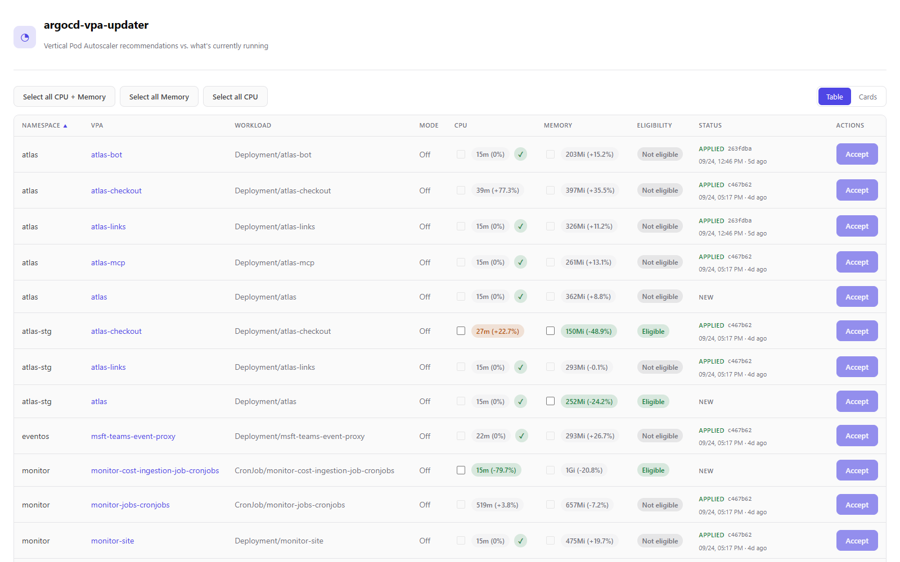
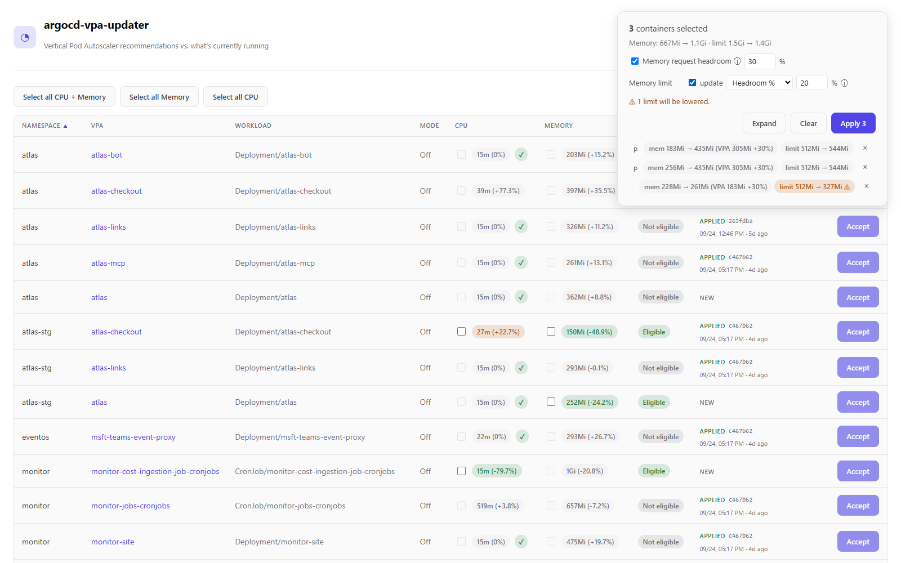
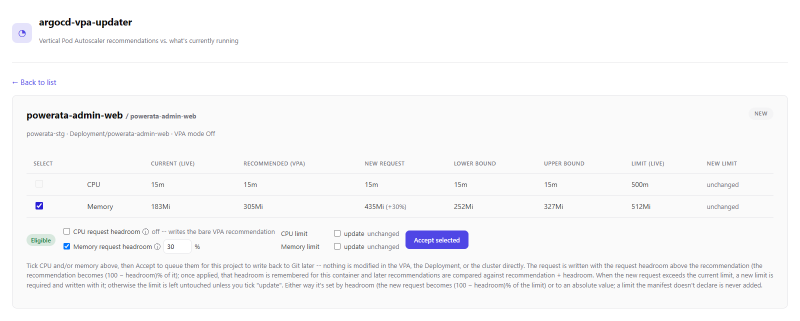
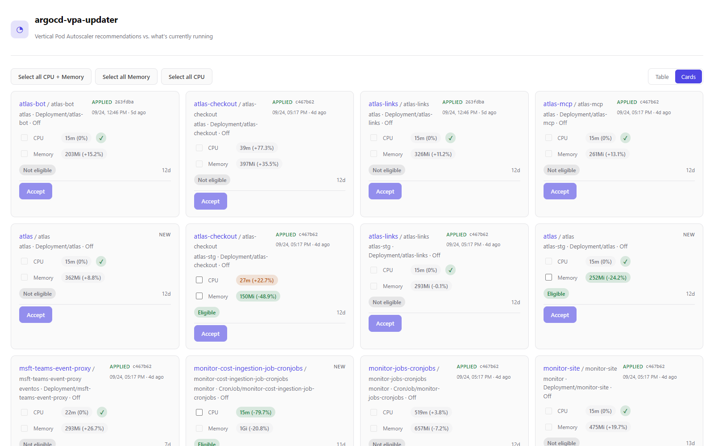
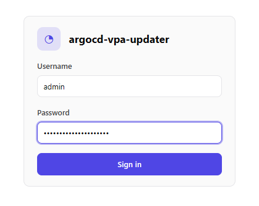

# argocd-vpa-updater

**Right-size your Kubernetes workloads with Vertical Pod Autoscaler
recommendations, without giving up GitOps.**

[](https://github.com/AzureBrasil-cloud/argocd-vpa-sync/actions/workflows/ci.yml)
[](LICENSE)

## The problem

Most teams guess their containers' CPU and memory requests once and never
revisit them. The result is paid-for capacity that sits idle, and, just as
often, workloads that are throttled or OOMKilled because they outgrew
their original numbers.

The Kubernetes [Vertical Pod Autoscaler](https://github.com/kubernetes/autoscaler/tree/master/vertical-pod-autoscaler)
(VPA) already knows better: it watches real usage and recommends a request
for every container. But in a GitOps setup, where Argo CD keeps the cluster
in line with Git, there is no good way to use those recommendations:

- **VPA in `Auto` mode** rewrites Pods behind Git's back. The cluster
  stops matching the repository, and Argo CD and the VPA fight over the
  same fields on every sync.
- **VPA in `Off` mode** only records recommendations. Someone has to find
  them with `kubectl`, compare them with what is running, and copy the
  numbers into each values file by hand, so in practice it rarely happens.

## The solution

`argocd-vpa-updater` turns VPA recommendations into reviewed Git commits.
It keeps VPAs in recommendation-only mode, shows each recommendation next to
what the workload is running today, and, once someone approves it, writes
the new values to the manifest in Git. Argo CD then rolls the change out
like any other.

```
VPA recommendation → review in the dashboard → Git commit → Argo CD sync → normal rollout
```

**Every recommendation next to what's running.** Deltas are colored by
direction, and a recommendation is flagged *eligible* only when the change
is large enough to be worth applying.



**Apply several at once, with safety margins.** Select the containers to
change, optionally add headroom above the VPA's number, and choose how
limits follow the new requests. The summary shows exactly what will be
written, and warns when a limit would go down.



**The full picture for each container**: the current value, the VPA's
target and its lower/upper bounds, the resulting request and limit, and the
status of the last write-back.



<details>
<summary>Cards view, and the optional login</summary>





</details>

What you get:

- **Git stays the source of truth.** Nothing in the cluster is changed
  directly: no Pod, Deployment, StatefulSet or VPA. The only way a change
  happens is a commit in Git.
- **A human approves every change**, using the numbers that are actually
  running.
- **Limits are handled.** A new request never ends up above its limit,
  which Kubernetes would reject.
- **No new credentials to manage.** It pushes with the repository
  credentials Argo CD already has.
- **Opt-in per workload.** Nothing happens until you create a
  `VpaGitOpsBinding` for a VPA.

## How it works

1. **Opt a VPA in.** Create a `VpaGitOpsBinding` next to it, pointing at
   the Git repository, the file, and the keys that hold the container's
   resources.
2. **Review.** The dashboard lists every opted-in container, comparing the
   VPA's recommendation with the request of the live workload.
3. **Select.** Pick the containers and resources to change, one at a time
   or in bulk. Selections are queued; nothing is written yet.
4. **Commit.** A background worker patches the file, preserving its
   comments and formatting, and commits and pushes it. Argo CD syncs it
   from there.

### When a recommendation is eligible

A recommendation is offered for approval only when all of these hold:

- The VPA has a recommendation and the workload has a current request.
- The recommendation respects the VPA's own `minAllowed`/`maxAllowed`.
- It differs from the current request by at least `minChangePercent`
  (10% by default, configurable per binding and per container).
- The current request is outside the range the VPA considers acceptable
  (its `lowerBound`..`upperBound`). A request already inside that range is
  left alone.

### Using it with an HPA

Many workloads also scale horizontally, and that is exactly where badly
sized requests hurt the most: an HPA's utilization is measured against the
request, so a wrong request makes it scale at the wrong time. This tool
exists to correct those requests. Every change is reviewed by a person
before it reaches Git, and the request headroom setting keeps a margin
above the VPA's number before a utilization-based HPA scales out.

## Getting started

Install the Helm chart, published as an OCI artifact on Docker Hub, into
Argo CD's namespace:

```sh
helm install argocd-vpa-sync oci://registry-1.docker.io/azurebrasil/argocd-vpa-sync \
  --version 0.1.0 --namespace argocd
```

Then opt a VPA in. The VPA must use `updateMode: "Off"`. The binding lives in
the same namespace as the VPA:

```yaml
apiVersion: argocd-vpa-updater.argoproj.io/v1alpha1
kind: VpaGitOpsBinding
metadata:
  name: checkout-api-vpa-sync
  namespace: payments
spec:
  vpaRef:
    name: checkout-api-vpa
  argoCDApplicationRef:                # optional; only used for a repo-url cross-check warning
    name: payments-api
  repoURL: https://git.example.com/team/app.git
  repoBranch: main
  writeBackPolicy: commit              # default: commit and push to repoBranch
  minChangePercent: 10                 # default eligibility threshold; overridable per container
  containers:
    - name: app
      manifestType: helm-values        # helm-values | yaml
      manifestPath: apps/payments/values-prd.yaml
      cpuKeyPath: resources.requests.cpu
      memoryKeyPath: resources.requests.memory
      # never inferred -- omit to leave that limit untouched
      cpuLimitKeyPath: resources.limits.cpu
      memoryLimitKeyPath: resources.limits.memory
```

`containers` is a list, so one binding can configure write-back for more
than one container of the VPA's target workload. `cpuKeyPath`/`memoryKeyPath`
support indexing into a container list by name, e.g.
`spec.template.spec.containers[app].resources.requests.cpu` for a plain
Deployment manifest; a Helm values file typically uses a plain dotted path
like `resources.requests.cpu`.

Open the dashboard:

```sh
kubectl -n argocd port-forward svc/argocd-vpa-sync 8080:8080
# http://localhost:8080
```

To install it somewhere other than Argo CD's namespace, set
`argocd.namespace` to where Argo CD runs, and `ssh.extraKnownHosts` to the
SSH host keys to trust (see [Credentials](#credentials)).

## Authentication (optional)

By default there is **no login**: anyone who can reach the Service can use
the dashboard, including the actions that queue Git commits. Keep it that
way only behind a private network, `kubectl port-forward`, or an
authenticating proxy.

To require a login, set an admin password. As with Argo CD's `admin` user,
the password is only ever stored as a **bcrypt** or **argon2id** hash:

```sh
# bcrypt
htpasswd -nbBC 10 "" 'my-password' | tr -d ':\n'
argocd account bcrypt --password 'my-password'
# argon2id
echo -n 'my-password' | argon2 "$(openssl rand -hex 16)" -id -e
```

```sh
helm upgrade argocd-vpa-sync oci://registry-1.docker.io/azurebrasil/argocd-vpa-sync \
  --namespace argocd --reuse-values \
  --set auth.admin.passwordHash='$2a$10$...' \
  --set auth.sessionSigningKey="$(openssl rand -hex 32)"
```

Or keep the credentials out of your values with an existing Secret, via
`auth.existingSecret`. It needs the key `admin.password` (the hash) and,
optionally, `server.secretkey` (the session signing key, at least 32
characters).

- Signing in returns a session that lasts `auth.sessionTTL` (24h), stored
  in an `HttpOnly`, `SameSite=Strict` cookie. API clients can send the
  `token` returned by `POST /api/v1/session` as `Authorization: Bearer`
  instead.
- Changing the password logs everyone out. So does restarting the pod when
  no `sessionSigningKey` is set, because it then picks a random key on
  startup.
- Repeated failed logins from the same IP are slowed down.
- The cookie is `Secure`, so browsers only send it over HTTPS or
  `http://localhost`. If the dashboard is served over plain HTTP on another
  host, set `auth.cookieSecure=false`.
- The pod reads the Secret at startup. Run `kubectl rollout restart` after
  rotating an `existingSecret`.

## Configuration

The most common values are below. See
[`values.yaml`](deploy/helm/argocd-vpa-sync/values.yaml) for the rest
(resources, security context, scheduling, extra env vars).

| Value | Default | Description |
|---|---|---|
| `image.repository` / `image.tag` | `azurebrasil/argocd-vpa-updater` / chart `appVersion` | Container image |
| `argocd.namespace` | `argocd` | Where Argo CD, its Applications and its repository Secrets live |
| `ssh.knownHostsConfigMap` | `argocd-ssh-known-hosts-cm` | SSH host keys to trust (a ConfigMap in the release namespace) |
| `ssh.extraKnownHosts` | `""` | Host keys to trust instead, in `ssh_known_hosts` format |
| `writeback.pollIntervalSeconds` | `20` | How often queued selections are committed |
| `auth.admin.passwordHash` | `""` | bcrypt/argon2id hash of the admin password. Setting it turns the login on |
| `auth.admin.username` | `admin` | Admin username |
| `auth.existingSecret` | `""` | Secret with `admin.password` (and optionally `server.secretkey`), instead of the two values above |
| `auth.sessionSigningKey` | `""` | Session signing key (at least 32 characters). Random per pod start when empty |
| `auth.sessionTTL` | `24h` | Session lifetime |
| `auth.cookieSecure` | `true` | Only send the session cookie over HTTPS |
| `ingress.enabled` | `false` | Expose the dashboard through an Ingress |
| `networkPolicy.enabled` | `false` | Only allow traffic to the HTTP port from `networkPolicy.from` |

---

## Technical details

### Architecture

```
cmd/argocd-vpa-updater/   entry point: wires everything below, runs the
                          controller-runtime manager and the HTTP API side
                          by side in one process

internal/
  domain/                 core types shared by every package (no k8s/git deps)
  vpaapi/                 minimal local VerticalPodAutoscaler API types
                          (autoscaling.k8s.io/v1), hand-written to avoid
                          pulling the full k8s.io/autoscaler module
  apis/vpagitopsbinding/v1alpha1/
                          the VpaGitOpsBinding CRD's Go types (codegen'd
                          deepcopy + CRD YAML via controller-gen, see
                          `make generate`/`make crds`)
  controller/             reconciler: watches VpaGitOpsBinding CRs (and, as a
                          secondary watch, the VPAs they reference), writing
                          normalized state into vparecommendation.Cache
  vparecommendation/      VpaRecommendationReader contract + in-memory cache
  resolver/                GitOpsTargetResolver: a binding's spec -> WriteTarget
  argocdapp/              reads the Argo CD Application CR (repo-url cross-check only)
  workloadresources/      reads the current resources.requests straight off
                          the live Deployment/StatefulSet/CronJob a VPA
                          targets -- this, not Git, is what the dashboard
                          diffs a recommendation against
  patcher/                ManifestPatcher: edits resources.requests/limits in
                          a file's content, preserving everything else
  credentials/            RepositoryCredentialsProvider: reads Argo CD's own
                          repository credential Secrets
  gitexec/                shells out to the real `git` binary (see note below)
  gitrepo/                read-only Git access to a file's declared content,
                          with a short-TTL cache -- used by write-back to
                          read what it's about to patch, not by the dashboard
  gitwriteback/           GitWriteBackService contract + FakeGitWriteBackService
  gittest/                shared test helpers for local Git repos
  statestore/             StateStore contract + Secret-backed implementation
                          with optimistic concurrency and retention/compaction
  eligibility/            delta + minimum-change-threshold + eligibility rules
  idempotency/            deterministic key for "this exact recommendation,
                          applied to this exact target"
  auth/                   admin password hashes (bcrypt/argon2id), signed
                          session tokens, login throttling
  api/                    HTTP API consumed by the dashboard

web/                      React + Vite dashboard (SPA)
deploy/helm/argocd-vpa-sync/
                          Helm chart (CRD, RBAC, Deployment, Service, auth Secret)
test/integration/         end-to-end test against a real local Git repository
```

### Why the `git` CLI instead of a pure-Go Git library

`internal/gitrepo` (the read path write-back uses to fetch a file before
patching it) shells out to the real `git` binary via `internal/gitexec`
rather than using
[go-git](https://github.com/go-git/go-git). This was a deliberate switch
after production testing: go-git failed against a real Azure DevOps-hosted
repository with an opaque `object not found` error -- the resolved branch
ref pointed at a commit that wasn't actually present in what go-git fetched
-- across shallow, full, and single-branch clone variations, with no
network error or OOM involved. The organization's own git-based tooling
(which shells out to real git) works fine against the same repository. As a
consequence, the runtime container is **not** distroless: it needs `git` and
an SSH client installed (see `Dockerfile`). `internal/gitwriteback`'s fake
implementation still uses go-git internally, since it only ever operates
against local (`file://`) repositories in tests, where the incompatibility
doesn't apply.

### Core contracts

| Contract | Package | Purpose |
|---|---|---|
| `VpaRecommendationReader` | `internal/vparecommendation` | List every opted-in VPA, normalized |
| `GitOpsTargetResolver` | `internal/resolver` | VPA + container -> resolved Git write target |
| `workloadresources.Reader` | `internal/workloadresources` | VPA's live workload + container -> current resources.requests |
| `ManifestPatcher` | `internal/patcher` | Read/patch resource values in a file, preserving structure |
| `RepositoryCredentialsProvider` | `internal/credentials` | Resolve Git credentials without duplicating Argo CD's own |
| `GitWriteBackService` | `internal/gitwriteback` | Commit and push, idempotently, without force-overwriting conflicts |
| `StateStore` | `internal/statestore` | Persist small operational state, swappable backend |

### Limits

When a container declares `cpuLimitKeyPath` / `memoryLimitKeyPath`,
write-back also rewrites that limit, so a new request can never exceed the
limit already in Git (which Kubernetes rejects with `requests: Invalid
value: ... must be less than or equal to memory limit`). The dashboard lets
you choose, per resource, how the limit is set:

- **Headroom %** (default 20%): the new request becomes `(100 - headroom)%`
  of the limit, i.e. `limit = request / (1 - headroom/100)`, rounded up.
  A 305Mi request at 20% gets `305Mi / 0.8 = 381.25Mi -> 382Mi`. Must be
  `>= 0` and `< 100`.
- **Absolute value**: the limit is written exactly as given, in any
  Kubernetes quantity valid for the resource (memory: `512Mi`, `1Gi`,
  `1.5G`...; CPU: `500m`, `0.5`, `2`). It must not be below the new request.

Notes:

- The limit is always recalculated, so it can go **down** as well as up;
  the summary flags every limit that will be lowered.
- Limit key paths are **never inferred** from the request key paths (a Helm
  values layout can put the limit anywhere). Without them, only the request
  is written and the dashboard shows a warning.
- A limit the file doesn't declare is left absent, never added.

`status.conditions[type=Ready]` reports validation problems (missing
required field, unknown enum value, the referenced VPA not found, or
`updateMode != Off`) natively via `kubectl get vpagitopsbindings` /
`kubectl describe`, alongside the same information surfaced in the
dashboard.

### Credentials

`argocd-vpa-updater` never stores its own Git tokens. It reads the
repository credential Secrets Argo CD already manages, in Argo CD's own
namespace, matching the same labels Argo CD itself uses
(`argocd.argoproj.io/secret-type: repository|repo-creds`). See
`internal/credentials/argocd_secret_provider.go`.

For SSH-authenticated repositories, host key verification is always strict
(`StrictHostKeyChecking=yes`) — there is no insecure fallback. The known_hosts
data comes from either the matched Secret's `sshKnownHosts` field, or, since
that field is rarely populated on Argo CD's own repo Secrets, from Argo CD's
central `argocd-ssh-known-hosts-cm` ConfigMap (mounted as `optional: true`, so
its absence never blocks the pod from starting), pointed at via
`SSH_KNOWN_HOSTS` (see the chart's `ssh.*` values and
`internal/gitexec/runner.go`). That ConfigMap can only be mounted when the
chart is installed in Argo CD's namespace; elsewhere, set
`ssh.extraKnownHosts`. This mirrors the same ConfigMap/mount
convention as the upstream `argocd-image-updater` Helm chart, which is why
that controller has never needed extra known_hosts configuration here either.
A host missing from both — e.g. a
`git ls-remote`/writeback failing with `Host key verification failed` for a
host Argo CD itself syncs fine — means that ConfigMap needs the host's key
added on the Argo CD side (`argocd cert add-ssh --batch` or Argo CD's
Settings → Certificates UI).

### RBAC

See `deploy/helm/argocd-vpa-sync/templates/rbac-*.yaml` for the exact
rules. Summary:

| Scope | Resource | Verbs |
|---|---|---|
| cluster | `autoscaling.k8s.io/verticalpodautoscalers` | get, list, watch |
| cluster | `argoproj.io/applications` | get, list, watch |
| cluster | `argocd-vpa-updater.argoproj.io/vpagitopsbindings` | get, list, watch |
| cluster | `argocd-vpa-updater.argoproj.io/vpagitopsbindings/status` | get, update, patch |
| cluster | `apps/deployments`, `apps/statefulsets` | get |
| cluster | `batch/cronjobs` | get |
| release namespace | `secrets/<release>-state` (by name) | get, update |
| release namespace | `secrets` | create |
| Argo CD namespace | `secrets` | get, list, watch |

The Deployment/StatefulSet/CronJob grant is `get` only, never `list`/`watch`:
the dashboard reads one named workload at a time to show the container
resources currently running (`internal/workloadresources`), it never
enumerates them, and its client has caching disabled for these types so no
cluster-wide watch is ever attempted.

The controller creates its state Secret on first use, so its content is
never owned (or reset) by Helm or Argo CD. RBAC cannot scope `create` by
name, hence the namespace-wide `create`; it grants no read access.

The Argo CD namespace grant is broader than ideal — Kubernetes RBAC cannot
filter `list`/`watch` on Secrets by label — see the comment in
`templates/rbac-repo-creds.yaml` for the full rationale and follow-up
options. The application code itself only ever reads
labeled repository-credential Secrets and never logs or returns their
content (`domain.GitCredentials` redacts itself in every serialization
path).

### Upgrading the CRD

Helm installs the `VpaGitOpsBinding` CRD from the chart's `crds/` directory
on first install but, by design, never upgrades or deletes it. After an
upgrade that changes the CRD, apply it yourself:

```sh
helm pull oci://registry-1.docker.io/azurebrasil/argocd-vpa-sync --version <version> --untar
kubectl apply --server-side -f argocd-vpa-sync/crds/
```

## Development

### Running locally

```sh
go build ./cmd/argocd-vpa-updater
# needs a cluster with the VPA CRDs installed
KUBECONFIG=... ./argocd-vpa-updater

cd web && npm install && npm run dev    # dashboard, proxies /api to :8080
```

When run directly, the binary reads these environment variables:

- `ADMIN_PASSWORD_HASH`, `ADMIN_USERNAME`, `SESSION_SIGNING_KEY`,
  `SESSION_TTL`, `COOKIE_SECURE`: the same settings as `auth.*` in the
  chart.
- `ARGOCD_NAMESPACE`, `STATE_SECRET_NAMESPACE`, `STATE_SECRET_NAME`,
  `WRITEBACK_POLL_INTERVAL_SECONDS`, `SSH_KNOWN_HOSTS`, `LISTEN_ADDR`.

### Testing

```sh
go build ./... && go vet ./... && go test ./...
cd web && npm run build
helm lint deploy/helm/argocd-vpa-sync
```

Unit tests cover delta/eligibility calculation, idempotency key derivation,
binding validation, target resolution (including multi-container bindings),
YAML/Helm-values patching (including comment/structure preservation), state
retention and optimistic concurrency, and the reconciler (including its
field-indexed secondary watch on VerticalPodAutoscaler, which must not leak
across namespaces). `test/integration` exercises the
fake write-back service end to end against a real local Git repository:
applying a recommendation, replaying it idempotently (no duplicate commit),
and a genuine concurrent-edit race that must be rejected as a conflict
without partially writing anything.

### Releasing

- **Image:** push a `vX.Y.Z` tag. `docker-publish.yml` publishes `X.Y.Z`,
  `X.Y` and `latest` for linux/amd64 and linux/arm64, and every push to
  `master` publishes `edge`. Keep the chart's `appVersion` set to the image
  version it ships.
- **Chart:** bump `version` in `deploy/helm/argocd-vpa-sync/Chart.yaml`.
  `chart-publish.yml` pushes it on merge to `master`, and never overwrites a
  version that is already published.

Both workflows need the `DOCKERHUB_USERNAME` and `DOCKERHUB_TOKEN`
repository secrets.

## License

[MIT](LICENSE)
